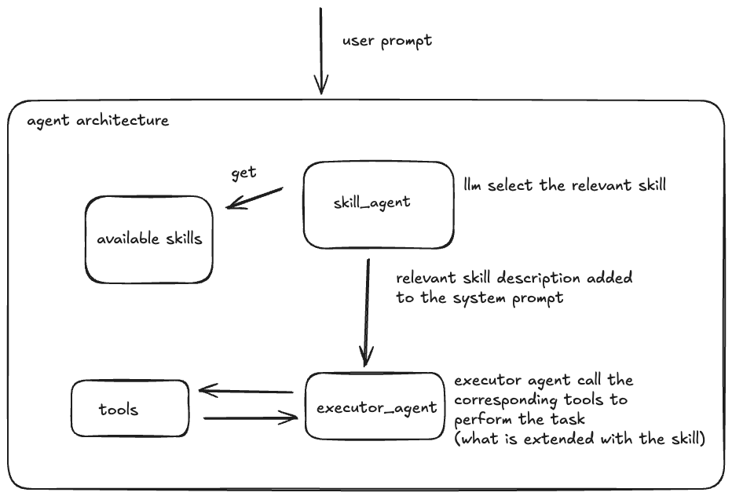

# Skill-First AI Agent Architecture with LangGraph

A modular AI agent system that uses a skill-first architecture to intelligently select and execute domain-specific tasks. Built with LangGraph, LangChain, and Ollama, this project demonstrates progressive skill disclosure where the agent dynamically loads only the most relevant skills based on user queries.

## Architecture



The system follows a two-agent architecture:

1. **Skill Agent**: Analyzes the user prompt and selects the most relevant skill from available skills
2. **Executor Agent**: Receives the selected skill instructions and executes the corresponding tools to complete the task

### Architecture Flow

```
User Prompt
    ↓
Skill Agent (LLM selects relevant skill)
    ↓
Available Skills → Skill Selection → Skill Description Added to System Prompt
    ↓
Executor Agent (Calls corresponding tools)
    ↓
Tools ↔ Executor Agent (Extended with skill instructions)
    ↓
Result
```

## Key Features

- **Progressive Skill Disclosure**: Only loads relevant skills based on user intent
- **Modular Skill System**: Easy to add new skills as markdown files
- **Kubernetes Integration**: Built-in tools for Kubernetes cluster operations
- **Custom Resource Support**: Handles custom Kubernetes resources (CRDs) (customer notification)
- **LangGraph Orchestration**: Uses state graphs for agent workflow management
- **Local LLM Support**: Runs on Ollama with llama3.1:8b

## 📁 Project Structure

```
skill_app/
├── agents/
│   ├── skill_agent.py         # Selects the most relevant skill
│   └── executor_agent.py      # Executes tasks using tools
├── skills/
│   ├── kubectl_skill/         # Kubernetes kubectl commands
│   ├── k8s_diagnostic_skill/  # Kubernetes diagnostics workflow
│   └── customer_notification_skill/  # Customer notification service checks
├── tools/
│   ├── kubernetes_tools.py    # K8s API tools (pods, logs, etc.)
│   └── customer_notification_tools.py  # Custom notification CRD tools
├── skill_registry/
│   └── skills.py              # Loads skills from markdown files
├── states/
│   └── state.py               # LangGraph state definitions
└── main.py                    # Entry point
```

## Getting Started

### Prerequisites

- Python 3.13+ and uv
- [Ollama](https://ollama.ai/) with `llama3.1:8b` model
- Kubernetes cluster access (for K8s tools)
- `kubectl` configured


### Installation

```bash
uv init skill_app   #this is not relevant
cd skill_app

uv add langgraph
uv add langchain
uv add langchain_ollama
uv add kubernetes
```


### Pull the Ollama model

```bash
ollama pull llama3.1:8b
```


### Running the Application

```bash
cd skill_app
uv run main.py
```

## Available Skills

### 1. **kubectl_skill**
Provides guidance on Kubernetes kubectl commands and cluster operations.
- Lists common kubectl commands
- Explains command options and flags
- Provides troubleshooting steps

### 2. **k8s_diagnostic_skill**
Executes a structured diagnostic workflow for Kubernetes pods.
- Checks logs first
- Lists pods in a namespace
- Provides detailed pod information
- Supports specific pod queries

### 3. **customer_notification_skill**
Health check for customer notification service in kcp-system namespace.
- Lists customer notification custom resources
- Checks customer notification operator pod status
- Analyzes service health (OK/Issues)
- Color-coded terminal output

## Available Tools

### Kubernetes Tools
- `list_pods(namespace)` - List all pods in a namespace
- `get_pod_details(pod_name, namespace)` - Get detailed pod information
- `get_pod_logs(pod_name, namespace, container, tail_lines)` - Retrieve pod logs
- `list_namespaces()` - List all namespaces

### Customer Notification Tools
- `list_customer_notification_pods(namespace)` - List customer notification operator pods
- `list_customer_notifications(namespace)` - List all customer notification CRs
- `get_customer_notification_details(name, namespace)` - Get specific CR details

## Usage Examples

### Check Customer Notification Service
```python
agents.executor_agent.invoke_agent(agent, "Please check the customer notification service.")
```

### List Pods
```python
agents.executor_agent.invoke_agent(agent, "Please list the pods on the default namespace")
```

### Get Pod Details
```python
agents.executor_agent.invoke_agent(agent, "Get details of this pod: my-pod-name on the default namespace")
```

## How It Works

### 1. Skill Selection Phase
When a user submits a query:
1. The **Skill Agent** receives the query
2. It uses a structured LLM call to select the most relevant skill
3. Only ONE skill is selected based on keyword matching and intent analysis

### 2. Skill Loading Phase
1. The selected skill's full content is loaded from the markdown file
2. Skills contain detailed instructions, tool call examples, and workflows
3. The skill content is added to the system prompt

### 3. Execution Phase
1. The **Executor Agent** receives the query + skill instructions
2. It identifies which tools to call based on the skill
3. Tools are invoked with appropriate parameters
4. Results are analyzed and presented to the user

### 4. Tool Calling Loop
1. LLM decides which tools to call
2. Tools are executed
3. Results are fed back to the LLM
4. Process repeats until task completion

## Adding New Skills

Skills are markdown files with YAML frontmatter:

```markdown
---
name: my-custom-skill
description: Brief description for skill selection
---

# Skill Title

## Required Actions:
1. Call `tool_name` with parameters
2. Analyze results
3. Report findings

## Analysis Guidelines:
- Condition A → Result X
- Condition B → Result Y
```

Place the skill file in: `skill_app/skills/my-custom-skill/my-custom-skill.md`

The skill will be automatically loaded by the skill registry.

## Troubleshooting

### Model Not Calling Tools
The `llama3.1:8b` model may sometimes generate explanations instead of tool calls. This is a known limitation. Consider:
- Using more explicit skill instructions
- Trying different Ollama models with better tool-calling support
- Using Claude or GPT models via API

### Skill Not Selected
If the wrong skill is selected:
- Update skill descriptions to include relevant keywords
- Modify the skill selection prompt in `skill_agent.py`
- Ensure skill names and descriptions are clear

### Kubernetes Connection Issues
- Verify `kubectl` is configured: `kubectl cluster-info`
- Check kubeconfig path: `echo $KUBECONFIG`
- Ensure proper RBAC permissions

## Technologies Used

- **[LangGraph](https://github.com/langchain-ai/langgraph)** - Agent workflow orchestration
- **[LangChain](https://github.com/langchain-ai/langchain)** - LLM framework and tool integration
- **[Ollama](https://ollama.ai/)** - Local LLM runtime
- **[Kubernetes Python Client](https://github.com/kubernetes-client/python)** - K8s API interaction
- **Python 3.13+** - Core language


**Note**: This is a tutorial project demonstrating skill-first architecture patterns. For production use, consider adding error handling, logging, authentication, and comprehensive testing.
